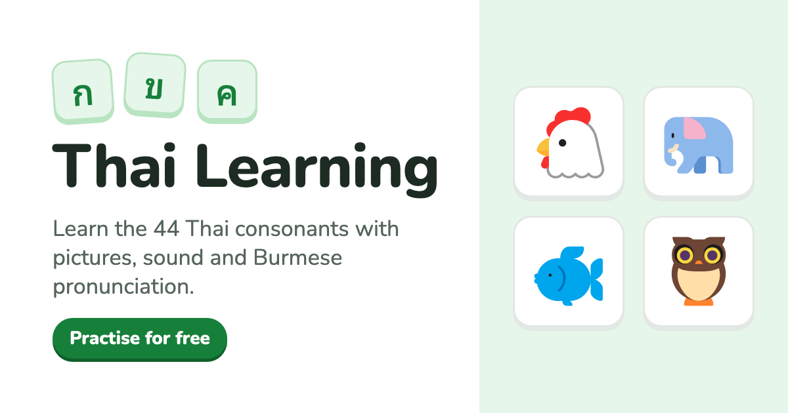

# Thai Learning



A responsive, client-side web app for Burmese-speaking learners studying Thai consonants and their vocabulary.

**Live site:** https://thai-learning-dxd.pages.dev

- **Consonants:** browse the 44 Thai consonants by class (Middle, High, Low). Each card shows the letter, a picture, the
  Thai word, its Burmese meaning and pronunciation, and plays the Thai letter name (e.g. "กอ ไก่").
- **Practice:** a 10-question picture quiz. Pick the matching answer, shown as letter and word (`ก (ไก่)`) with its
  Burmese pronunciation, hear it, then press Next to see ✓ or ✗. Turn on **Advanced** to mix in, at random, questions
  where you type the Thai word (hinted by its Burmese pronunciation) or say it aloud into the microphone. Speaking uses
  the browser's speech recognition (Chrome, Edge, Safari); where it is unavailable or the learner taps "Can't speak now",
  those questions become select or type questions.

There is no backend, database or user account. All learning content is static JSON bundled with the app, and practice
progress lives only in memory for the current session.

## Tech stack

React 19 · TypeScript · Vite · Tailwind CSS 4 · React Router · Vitest · React Testing Library · ESLint · Prettier · Stylelint

## Getting started

Requirements: Node.js 24 (see `.nvmrc`) and npm 11.

```bash
npm ci
npm run dev
```

Open http://localhost:5173.

## Scripts

| Command                 | What it does                                            |
| ----------------------- | ------------------------------------------------------- |
| `npm run dev`           | Start the Vite dev server                               |
| `npm run build`         | Type check and build the production bundle into `dist/` |
| `npm run preview`       | Serve the production build locally                      |
| `npm run lint`          | ESLint (TS/React/a11y/imports/Prettier) and Stylelint   |
| `npm run lint:fix`      | Auto-fix lint and formatting issues                     |
| `npm run typecheck`     | TypeScript project references check                     |
| `npm test`              | Run the test suite once                                 |
| `npm run test:watch`    | Run tests in watch mode                                 |
| `npm run test:coverage` | Run tests with a V8 coverage report                     |

## CI/CD

- **CI** (`.github/workflows/ci.yml`) runs on every pull request and on pushes to `develop` and `main`:
  install → lint → type check → unit tests → production build. A pull request is not ready until all steps pass.
- **Deploy**: Cloudflare Pages builds and publishes `main` as the live site, and gives every other branch and pull
  request its own preview URL. The hosting provider is not baked into the app; see
  [docs/development.md](docs/development.md#deployment).

## Branches and releases

| Branch    | Purpose                                                               |
| --------- | --------------------------------------------------------------------- |
| `develop` | Default branch; all work is merged here through pull requests         |
| `main`    | Released code; every merge deploys the live site via Cloudflare Pages |

1. Branch from `develop`, make the change, and open a pull request into `develop`. Merge once CI is green.
2. To release, open a pull request from `develop` into `main` and merge it. Cloudflare deploys within a minute or two.
3. Optionally merge `main` back into `develop` so the release merge commit exists on both branches.

Direct pushes, force-pushes and deleting `develop` or `main` are blocked; both change only through pull requests.
Details: [docs/development.md](docs/development.md#workflow).

## Documentation

- [AGENTS.md](AGENTS.md) — project rules for developers and AI coding agents
- [docs/architecture.md](docs/architecture.md) — structure, data flow and practice engine
- [docs/development.md](docs/development.md) — workflow, conventions, testing and deployment
- [docs/content-management.md](docs/content-management.md) — adding and reviewing learning content

## Content credits

Consonant vocabulary, Burmese pronunciations and meanings come from _Thi Thi's Thai Training — Basic + Level 1_.
Vocabulary pictures use [Microsoft Fluent Emoji](https://github.com/microsoft/fluentui-emoji) (MIT) and custom drawings
in the same style. The Thai audio is placeholder text-to-speech (macOS voice "Kanya") until native-speaker recordings are
added. See [docs/content-management.md](docs/content-management.md#sources-and-licensing) for provenance.
