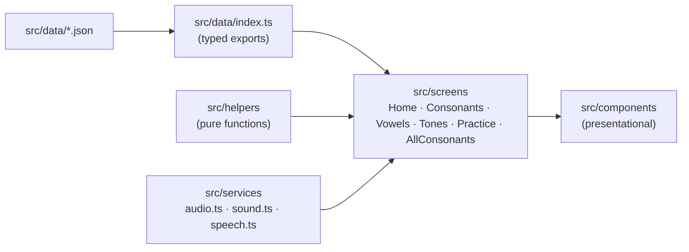
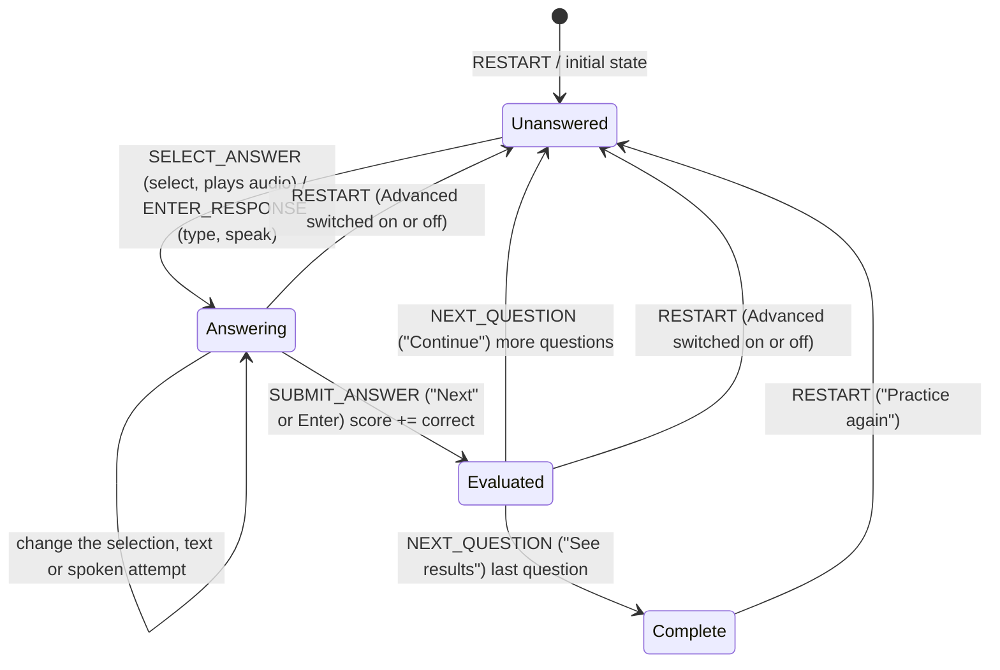

# Architecture

## Principles

1. Client-side only until persistence is actually required.
2. Learning content is data (`src/data/*.json`), never component code.
3. Burmese pronunciation is curated content and is never generated.
4. Thai audio is a separate asset from Burmese pronunciation.
5. Components present; screens compose; helpers compute; services perform side effects.
6. No abstraction before a real requirement.

## Layers



| Layer         | Responsibility                                      | May import                             |
| ------------- | --------------------------------------------------- | -------------------------------------- |
| `data/`       | Static content and its typed loader                 | `types/`                               |
| `helpers/`    | Pure, deterministic-when-seeded logic               | `types/`, `constants/`, other helpers  |
| `services/`   | Browser side effects (audio)                        | nothing app-specific                   |
| `components/` | Rendering and user interaction via props            | `helpers/`, `types/`, other components |
| `screens/`    | Routing targets: state, data, services, composition | everything                             |

## Routing

`BrowserRouter` with `basename = import.meta.env.BASE_URL`, so the app works at a domain root or a sub-path.

| Path                                           | Screen                                                                                                                                                                        |
| ---------------------------------------------- | ----------------------------------------------------------------------------------------------------------------------------------------------------------------------------- |
| `/`                                            | Home                                                                                                                                                                          |
| `/consonants?class=middle\|high\|low`          | Consonant browser (class kept in the URL so it can be linked)                                                                                                                 |
| `/vowels?group=short\|long\|extra\|standalone` | The 32 vowels in group tabs (group kept in the URL), with the short and long vowel tone rules and a middle / high / low class example per vowel                               |
| `/tones`                                       | The five tones and the tone rules table (class × live/dead syllable and tone marks)                                                                                           |
| `/practice`                                    | Picture quiz                                                                                                                                                                  |
| `/all`                                         | All 44 consonants as compact cards (letter, picture, Burmese meaning; no Thai word or audio) on one full-width page without the header; not linked, reached by typing the URL |
| `*`                                            | Redirects to `/`                                                                                                                                                              |

Static hosts must serve `index.html` for unknown paths. Cloudflare Pages does this automatically because the build has no
`404.html`.

## Data model

Types live in `src/types/learning.ts`.

```ts
type ConsonantClassId = 'middle' | 'high' | 'low';

interface ConsonantClass {
  id: ConsonantClassId;
  group: number; // 1 middle, 2 high, 3 low — the numbers asked in group questions
  name: string; // "Middle Class" — headings, badges
  shortName: string; // "Middle" — class tabs
  burmeseName: string;
  tone: string;
}

interface Word {
  id: string; // "<consonant>-<thai>", e.g. "ก-ไก่"
  thai: string; // "ไก่"
  pronunciation: string; // Burmese pronunciation as given in the source, e.g. "ကောကိုင်"
  meaning: string; // Burmese meaning, e.g. "ကြက်"
  image?: string; // "/images/words/kai.svg"
  audio?: string; // "/audio/words/kai.m4a"
}

interface Consonant {
  id: string;
  character: string;
  class: ConsonantClassId;
  words: Word[];
}

type AnswerMode = 'select' | 'class' | 'type' | 'speak';

interface PracticeQuestion {
  id: string;
  answer: VocabularyItem;
  options: VocabularyItem[]; // always generated, so any question can fall back to select
  mode: AnswerMode;
}
```

`words` is an array so a consonant can gain more vocabulary later without a schema change. Asset paths are stored
root-relative and resolved at render time with `assetUrl()` so a sub-path deployment still works.

## Practice engine

`src/helpers/practice.ts` is pure and UI-free.

- `generatePracticeQuestions(vocabulary, { questionCount, optionCount, modes, random })`
  - pool = vocabulary items that have an image;
  - shuffles the pool (question order) and takes `questionCount` answers (default `QUESTION_COUNT`, 10), each asked once;
    the learner sets 5–30 (`MIN_QUESTION_COUNT`, `MAX_QUESTION_COUNT`) in the ⋮ practice settings menu with − / +
    (one at a time) or by typing a number, applied on Enter or blur and clamped to the range; this restarts the practice;
  - for each answer picks `ANSWER_OPTION_COUNT - 1` (2) distractors from the same pool with unique Thai text;
  - shuffles the options so the correct position varies;
  - gives each question a random answer mode from `modes` (default `['select']`) via `assignAnswerModes`.
  - `random` is injectable for deterministic tests. `randomizeArray` never mutates its input.
- `getAnswerModes({ advanced, enabled })`: `select` only when Advanced is off; otherwise `select` plus each of
  `class`, `type` and `speak` that is enabled. The Practice screen enables them with the Audio / Type / Group checkboxes
  in the ⋮ practice settings menu right of the Advanced toggle (shown there while Advanced is on), and leaves `speak` out when the
  browser has no speech recognition. "Can't speak now" unticks Audio.
- `practiceReducer(state, action)` drives the session:



Switching Advanced on or off, or ticking a question type, restarts the practice with new questions in the new modes. `SET_ANSWER_MODES`
("Can't speak now") re-assigns the modes of the current question, if it is not yet evaluated, and every later question;
a current question whose mode changes loses its unsubmitted answer.

```ts
interface PracticeState {
  questions: PracticeQuestion[];
  currentQuestionIndex: number;
  selectedAnswerId: string | null; // select questions
  response: string; // typed text or the chosen speech transcript
  answered: boolean;
  score: number;
}
```

Invalid transitions (answering after evaluation, answering in the wrong mode, submitting with nothing selected or blank
text, advancing before evaluation) return the same state object. State lives in `useReducer` inside the Practice screen
and is never persisted; the Advanced toggle is screen state and starts off on every visit.

### Answer modes

| Mode     | Prompt                                                  | Correct when                                                                 |
| -------- | ------------------------------------------------------- | ---------------------------------------------------------------------------- |
| `select` | picture, "Which word is this?"                          | the chosen option is the answer                                              |
| `class`  | picture + `ก (ไก่)` and pronunciation, groups 1 / 2 / 3 | the chosen group is the letter's class (`VocabularyItem.consonantClass`)     |
| `type`   | picture + Burmese pronunciation hint                    | the text is the letter `ก`; `ไก่`, `ก ไก่`, `ก (ไก่)` or `กอ ไก่` also count |
| `speak`  | picture only, "Say this word"                           | a recognized transcript contains the word                                    |

`src/helpers/thaiAnswer.ts` compares after `normalizeThai` (NFKC, spaces, brackets and zero-width characters removed),
so mark order and `ำ`/`ํา` spellings don't matter. For `speak`, the recognizer returns up to 5 alternatives and the
first one containing the word is kept. Checking an answer plays a feedback sound; class, type and speak questions then play
the word's Thai audio once that sound has finished.

## Vowels

Data: `vowelGroups.json` and `vowels.json` (32 vowels: 12 short, 12 long, 4 extra ำ ใ ไ เา, 4 standalone ฤ ฤๅ ฦ ฦๅ). A
vowel id is its written form with `-` for the consonant (`เ-ือะ`); standalone vowels have no dash. Short and long
vowels have one tone rule per consonant class, from the source. Each consonant class names an
`exampleConsonant` (ก / ข / ค) and its English initial `exampleSound` (k / kh / kh); a vowel example's romanization is
`exampleSound` + the vowel's `sound` (กะ → ka).

`src/helpers/vowels.ts`: `combineVowel` replaces the dash with a consonant; `getVowelLabel` shows `◌` instead of the dash
where a mark sits above or below the consonant (`◌ิ`, `เ◌ีย`), because fonts can't stack a Thai mark on a dash.
The screen draws combinable groups with `VowelTable` (one row per vowel, a ก / ข / ค column per class) and standalone
vowels with `VowelCard`.

## Tones

Data: `tones.json` (5 tones with English and Thai name and a 1–5 pitch contour), `toneMarks.json` (่ ้ ๊ ๋) and
`guide.json` (the explanations on the tones screen: live/dead syllables, rules; English until the owner supplies Burmese).

- `src/helpers/tones.ts`: `getUnmarkedTone(class, 'live' | 'dead')` and `getMarkedTone(class, mark)` hold the tone rules.
  Only open syllables (no final consonant) are modelled.
- `src/helpers/vowels.ts`: short vowels make dead syllables, long and extra vowels live ones (`getSyllable`,
  `getSyllableTone`). `src/data/vowels.test.ts` checks each vowel group's written tone rule against these.

## Audio

`src/services/audio.ts` keeps a single `HTMLAudioElement`. `playAudio(src)` stops the current sound before starting the
next one, so rapid answer changes never overlap. Rejected playback (autoplay policy, missing file) is swallowed so
learning continues silently. Screens call `stopAudio()` on unmount and when moving to the next question.

## Feedback sounds

`src/services/sound.ts` synthesizes the check sounds with the Web Audio API, so there are no sound files: a rising
two-note chime for a correct answer and a low falling tone for an incorrect one (`FEEDBACK_SOUND_DURATION_MS` long).
One `AudioContext` is created lazily on the first check (a user gesture, as iOS requires) and resumed if the browser
suspended it. Missing Web Audio or any playback error is swallowed.

## Speech recognition

`src/services/speech.ts` wraps the Web Speech API (`SpeechRecognition`, or `webkitSpeechRecognition` in Safari).
`listen('th-TH')` runs one short recognition and always resolves, never rejects: `heard` with the transcripts,
`no-speech`, `blocked` (microphone permission or capture), `failed` (network, unsupported language…) or `aborted`.
Like audio, a single recognizer is active at a time; `stopListening()` aborts it. The Practice screen ignores results
that arrive after the question changed. Recognition runs on the browser vendor's service, so it needs a connection;
Firefox has no support, and there `speak` is never offered.

## Styling

Tailwind CSS 4 utilities in the markup, with the design tokens (colours, fonts, edge shadows, `xs` breakpoint, content
width) defined in the `@theme` block of `src/index.css`. The default Tailwind palette is disabled so only semantic tokens
exist. Visual direction: white background, green primary
actions with a pressed "shadow" edge, light-green supporting surfaces, rounded cards and buttons, large Thai glyphs.
Fonts are bundled with `@fontsource` (Nunito for UI, Noto Sans Thai Looped, Noto Sans Myanmar), so rendering does not
depend on the learner's installed fonts.

## Extending

- More vocabulary per consonant: append to `words`; the UI and practice pick it up automatically.
- Vowels/tones: add a new JSON file + type + screen; reuse `ConsonantCard`-style components and the practice engine
  (it only needs `VocabularyItem[]`).
- New practice modes: add a question generator beside `generatePracticeQuestions`; keep the reducer contract.
- Persistence/accounts: introduce a backend independently; content stays static JSON.
