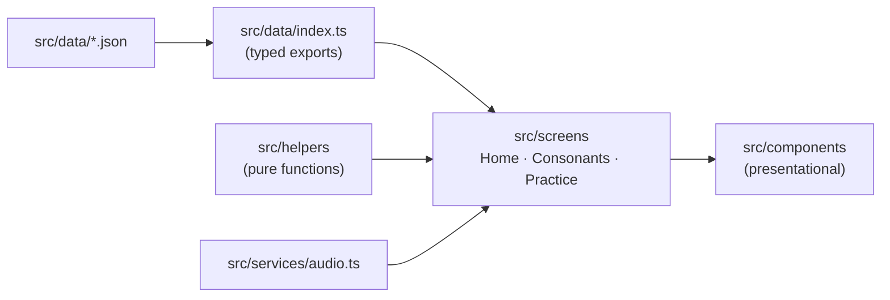
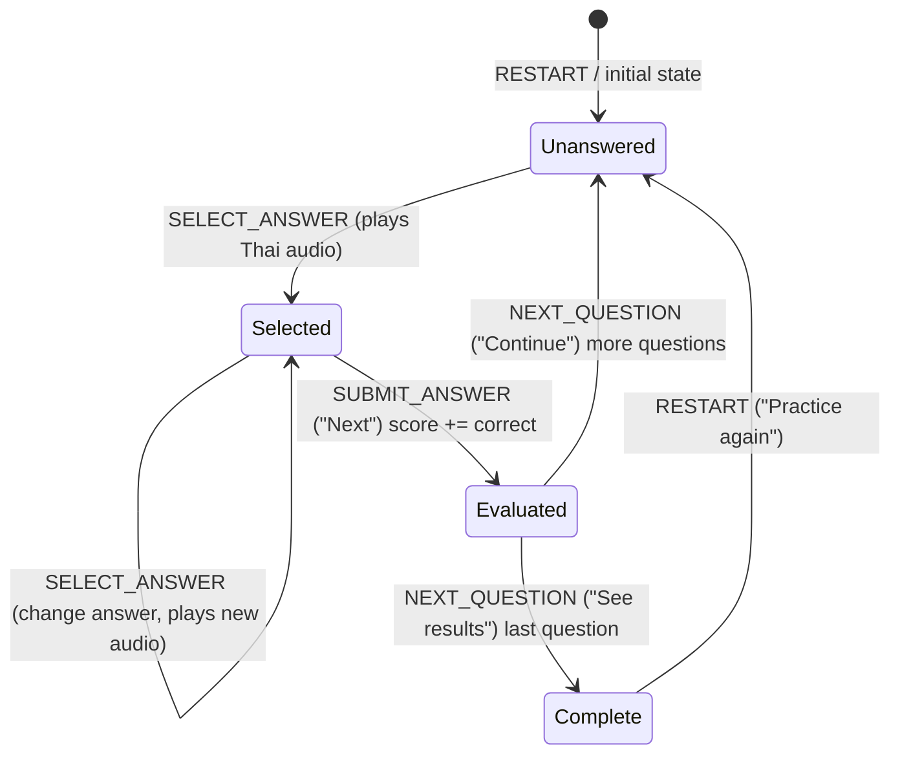

# Architecture

## Principles

1. Client-side only until persistence is actually required.
2. Learning content is data (`src/data/*.json`), never component code.
3. Burmese pronunciation is curated content and is never generated.
4. Thai audio is a separate asset from Burmese pronunciation.
5. Components present; screens compose; helpers compute; services perform side effects.
6. No abstraction before a real requirement.

## Layers



| Layer         | Responsibility                                      | May import                             |
| ------------- | --------------------------------------------------- | -------------------------------------- |
| `data/`       | Static content and its typed loader                 | `types/`                               |
| `helpers/`    | Pure, deterministic-when-seeded logic               | `types/`, `constants/`, other helpers  |
| `services/`   | Browser side effects (audio)                        | nothing app-specific                   |
| `components/` | Rendering and user interaction via props            | `helpers/`, `types/`, other components |
| `screens/`    | Routing targets: state, data, services, composition | everything                             |

## Routing

`BrowserRouter` with `basename = import.meta.env.BASE_URL`, so the app works at a domain root or a sub-path.

| Path                                  | Screen                                                        |
| ------------------------------------- | ------------------------------------------------------------- |
| `/`                                   | Home                                                          |
| `/consonants?class=middle\|high\|low` | Consonant browser (class kept in the URL so it can be linked) |
| `/practice`                           | Picture quiz                                                  |
| `*`                                   | Redirects to `/`                                              |

Static hosts must serve `index.html` for unknown paths (the deploy workflow copies it to `404.html` for GitHub Pages).

## Data model

Types live in `src/types/learning.ts`.

```ts
type ConsonantClassId = 'middle' | 'high' | 'low';

interface ConsonantClass {
  id: ConsonantClassId;
  name: string; // "Middle Class" — headings, badges
  shortName: string; // "Middle" — class tabs
  burmeseName: string;
  tone: string;
}

interface Word {
  id: string; // "<consonant>-<thai>", e.g. "ก-ไก่"
  thai: string; // "ไก่"
  pronunciation: string; // Burmese pronunciation as given in the source, e.g. "ကောကိုင်"
  meaning: string; // Burmese meaning, e.g. "ကြက်"
  image?: string; // "/images/words/kai.svg"
  audio?: string; // "/audio/words/kai.m4a"
}

interface Consonant {
  id: string;
  character: string;
  class: ConsonantClassId;
  words: Word[];
}
```

`words` is an array so a consonant can gain more vocabulary later without a schema change. Asset paths are stored
root-relative and resolved at render time with `assetUrl()` so a sub-path deployment still works.

## Practice engine

`src/helpers/practice.ts` is pure and UI-free.

- `generatePracticeQuestions(vocabulary, { questionCount, optionCount, random })`
  - pool = vocabulary items that have an image;
  - shuffles the pool (question order) and takes `QUESTION_COUNT` (10) answers, each asked once;
  - for each answer picks `ANSWER_OPTION_COUNT - 1` (2) distractors from the same pool with unique Thai text;
  - shuffles the options so the correct position varies.
  - `random` is injectable for deterministic tests. `randomizeArray` never mutates its input.
- `practiceReducer(state, action)` drives the session:



```ts
interface PracticeState {
  questions: PracticeQuestion[];
  currentQuestionIndex: number;
  selectedAnswerId: string | null;
  answered: boolean;
  score: number;
}
```

Invalid transitions (selecting after evaluation, submitting with nothing selected, advancing before evaluation) return
the same state object. State lives in `useReducer` inside the Practice screen and is never persisted.

## Audio

`src/services/audio.ts` keeps a single `HTMLAudioElement`. `playAudio(src)` stops the current sound before starting the
next one, so rapid answer changes never overlap. Rejected playback (autoplay policy, missing file) is swallowed so
learning continues silently. Screens call `stopAudio()` on unmount and when moving to the next question.

## Styling

Tailwind CSS 4 utilities in the markup, with the design tokens (colours, fonts, edge shadows, `xs` breakpoint, content
width) defined in the `@theme` block of `src/index.css`. The default Tailwind palette is disabled so only semantic tokens
exist. Visual direction: white background, green primary
actions with a pressed "shadow" edge, light-green supporting surfaces, rounded cards and buttons, large Thai glyphs.
Fonts are bundled with `@fontsource` (Nunito for UI, Noto Sans Thai Looped, Noto Sans Myanmar), so rendering does not
depend on the learner's installed fonts.

## Extending

- More vocabulary per consonant: append to `words`; the UI and practice pick it up automatically.
- Vowels/tones: add a new JSON file + type + screen; reuse `ConsonantCard`-style components and the practice engine
  (it only needs `VocabularyItem[]`).
- New practice modes: add a question generator beside `generatePracticeQuestions`; keep the reducer contract.
- Persistence/accounts: introduce a backend independently; content stays static JSON.
